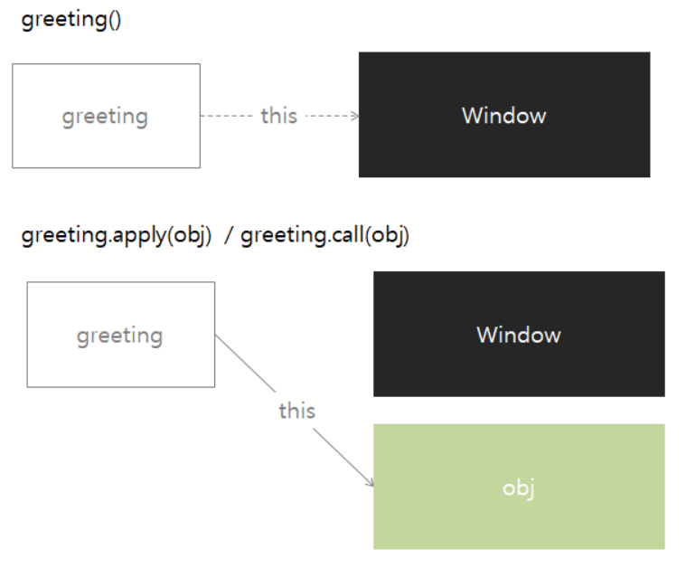

Call, Apply, Bind는 this와 관련이 있다. this를 특정 객체에 `명시적으로 바인딩` 시키는 메소드이다.  

### 먼저 Call, Apply를 코드로 살펴 보자
```javascript
const seungyoon = {
  name: 'seungyoon',
}

function greeting(city, hobby) {
  console.log(`Hello my name is ${this.name}, I live in ${city}. my hobby is ${hobby}.`);
}

greeting('seoul', 'listening to music'); // Hello my name is , I live in seoul. my hobby is listening to music.
greeting.apply(seungyoon, ['seoul', 'listening to music']); // Hello my name is seungyoon, I live in seoul. my hobby is listening to music.
greeting.call(seungyoon, 'seoul', 'listening to music'); // Hello my name is seungyoon, I live in seoul. my hobby is listening to music
```

이렇게 this 특정 객체에 명시적으로 바인딩 시키고 싶을 때 call, apply를 사용하면 된다.  
(여기서 call과 apply는  기능은 같지만 넘겨받는 인자의 형식만 다르다. call과 다르게 apply는 인자를 배열 형태로 받는다.)

### 나머지 bind 함수를 살펴보자.  
이 함수는 call apply와 다르게 함수를 즉시 실행하지 않는다.  
아래 코드와 같이 변수에 담아 호출 할 수가 있다.
```javascript
const seungyoon = {
  name: 'seungyoon',
}
    
function greeting(city, hobby) {
  console.log(`Hello my name is ${this.name}, I live in ${city}. my hobby is ${hobby}.`);
}

const seungyoonGreeting = greeting.bind(seungyoon);
seungyoonGreeting('seuol', 'listening to music'); // Hello my name is seungyoon, I live in seuol. my hobby is listening to music.
```
