오랜만에 퍼블리싱을 하면서 css flex를 사용하는데 확실한 이해를 위해 정리하게 되었다.

우선 flex는 container와 items으로 나눌 수 있다.  
\- container(`diplay: flex`를 선언한 Element)    
\- items(container 안에 Element들)

# Container
`display: flex`를 선언한 부분으로 바로 아래 있는 자식 Element들을 flexible하게 만들어 준다고 이해하면 된다.

```css
.container {
    display: flex;
    border: 2px solid #ccc;  
}
.item-a {
    width: 100px;
    height: 50px;
    background: #ff0000;
}
.item-b {
    width: 200px;
    height: 150px;
    background: #0026ff;
}
.item-c {
    width: 100px;
    height: 100px;
    background: #fffb00;
}
```
```html
<div class="container">
  <div class="item">A</div>
  <div class="item">B</div>
  <div class="item">C</div>
</div>
```
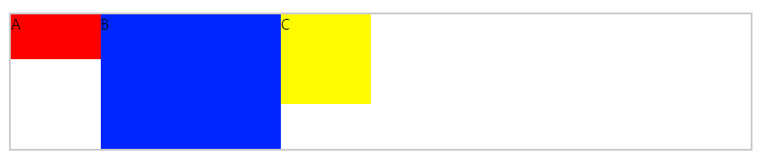

container(`diplay: flex`를 선언한 객체)에 flex관련 css는 아래와 같다.   
\- flex-direction  
\- flex-wrap  
\- flex-flow  
\- justify-content  
\- align-items  
\- align-content

## flex-direction
items를 어떻게 배치할지 설정하는 속성 (row | row-reverse | column | column-reverse)

```css
.container {
    display: flex;
    border: 2px solid #ccc;
    flex-direction: row; /* 기본값은 row */
}
.item-a {
    width: 100px;
    height: 50px;
    background: #ff0000;
}
.item-b {
    width: 200px;
    height: 150px;
    background: #0026ff;
}
.item-c {
    width: 100px;
    height: 100px;
    background: #fffb00;
}
```
```html
<div class="container">
  <div class="item">A</div>
  <div class="item">B</div>
  <div class="item">C</div>
</div>
```
### flex-direction: row


### flex-direction: row-reverse
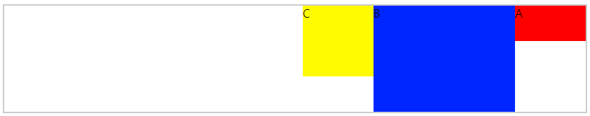

### flex-direction: column
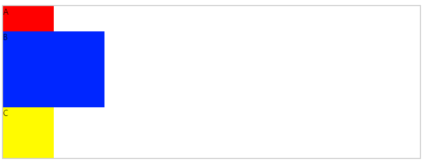

### flex-direction: column-reverse
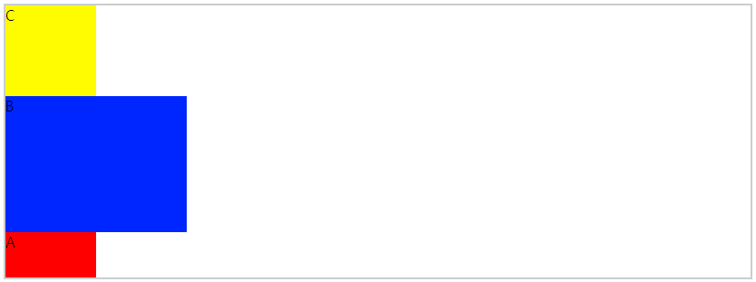


## flex-wrap
items가 container 넓이를 넘어 갈 때 처리 여부 (nowrap | wrap | wrap-reverse)  

```css
.container {
    display: flex;
    width: 500px;
    border: 2px solid #ccc;
    flex-wrap: nowrap; /* 기본값은 nowrap */
}
.item-a {
    width: 100px;
    height: 50px;
    background: #ff0000;
}
.item-b {
    width: 200px;
    height: 150px;
    background: #0026ff;
}
.item-c {
    width: 100px;
    height: 100px;
    background: #fffb00;
}
```
```html
<div class="container">
    <div class="item-a">A</div>
    <div class="item-b">B</div>
    <div class="item-c">C</div>
    <div class="item-a">A</div>
    <div class="item-b">B</div>
    <div class="item-c">C</div>
</div>
```

### flex-wrap: nowrap;
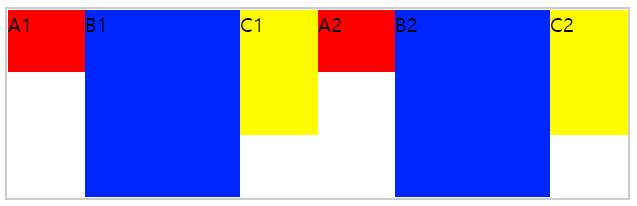
### flex-wrap: wrap;
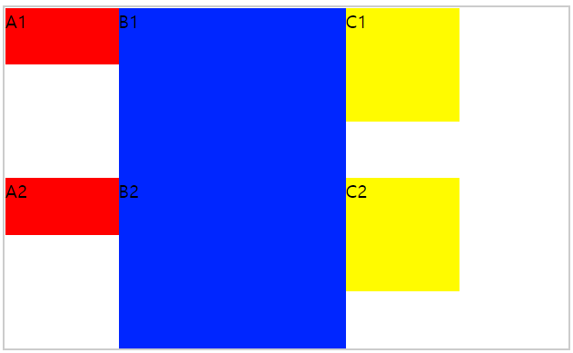
### flex-wrap: wrap-reverse;
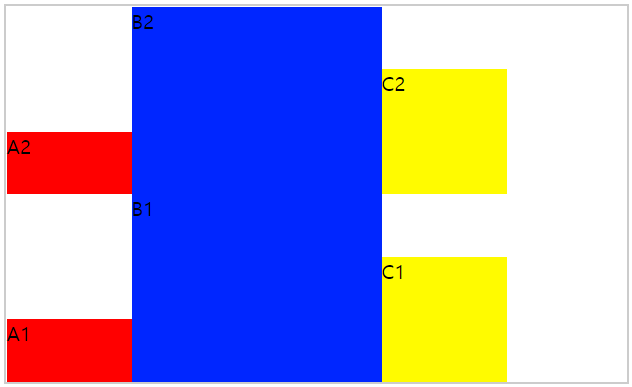

## flex-flow
위에 설명한 flex-direction과 flex-wrap을 합쳐서 사용할 때 쓰는 속성  
### flex-flow: (flex-direction) (flex-wrap)
```css
/* 예시 */
.container {
    flex-flow: column wrap;
}
```

## justify-content
items의 가로 정렬을 정의 할 때 사용 (flex-start | flex-end | center | space-around | space-between)  
센터 정렬 때문에 정말 많이 쓰는 속성이다.   
```css
.container {
  display: flex;
  border: 2px solid #ccc;
  justify-content: flex-start; /* 기본값은 flex-start */
}
.item-a {
  width: 100px;
  height: 50px;
  background: #ff0000;
}
.item-b {
  width: 200px;
  height: 150px;
  background: #0026ff;
}
.item-c {
  width: 100px;
  height: 100px;
  background: #fffb00;
}
```
```html
<div class="container">
    <div class="item-a">A</div>
    <div class="item-b">B</div>
    <div class="item-c">C</div>
</div>
```

### justify-content: flex-start
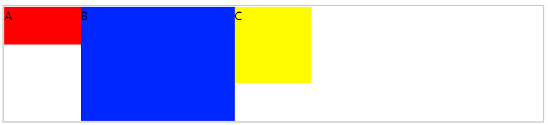

### justify-content: flex-end
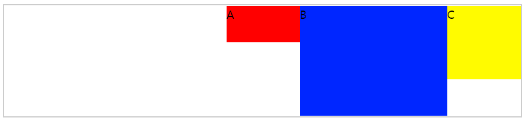

### justify-content: center
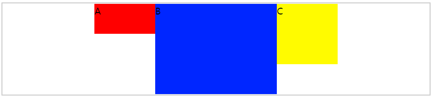

### justify-content: space-around
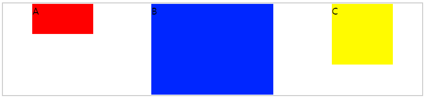

### justify-content: space-between
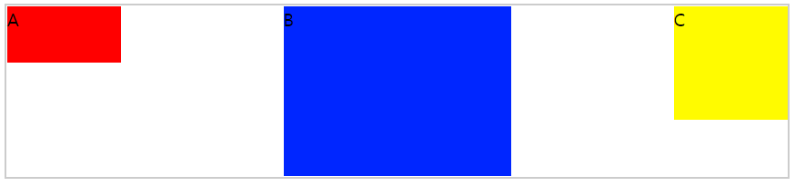

## align-items
items의 세로 정렬을 정의 할 때 사용 (stretch | flex-start | flex-end | center | baseline )  
이 속성 또한 많이 사용 (센터 정렬 시)
```css
.container {
  display: flex;
  border: 2px solid #ccc;
  height: 100px;
  align-items: stretch; /* 기본값은 stretch */
}
.item-a {
  width: 100px;
  background: #ff0000;
}
.item-b {
  width: 200px;
  background: #0026ff;
}
.item-c {
  width: 100px;
  background: #fffb00;
}
```
```html
<div class="container">
    <div class="item-a">A</div>
    <div class="item-b">B</div>
    <div class="item-c">C</div>
</div>
```
### align-items: stretch
기본 값으로 container 안에 items 높이를 적용 안해도 높이까지 뻗음
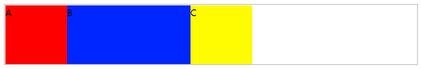

### align-items: flex-start
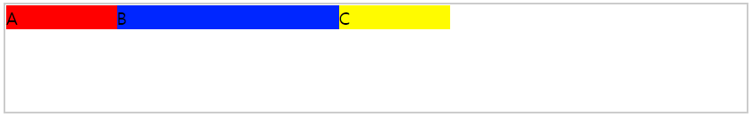

### align-items: flex-end
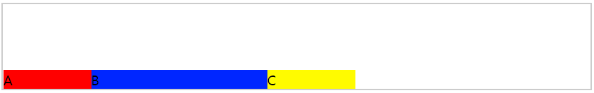

### align-items: center
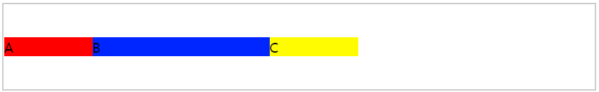

### align-items: baseline
텍스트를 기준으로 정렬
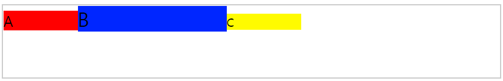

## align-content
justify-content의 세로 버전? 아래 이미지를 통해 어떻게 동작하는지 확인해보자  
stretch | space-between | center | space-around | flex-start | flex-end
```css
.container {
  display: flex;
  border: 2px solid #ccc;
  flex-wrap: wrap;
  height: 600px;
  align-content: stretch; /* 기본값 stretch */
}
.item-a {
  width: 100px;
  background: #ff0000;
}
.item-b {
  width: 100px;
  background: #0026ff;
}
.item-c {
  width: 100px;
  background: #fffb00;
}
```
```html
<div class="container">
    <div class="item-a">A</div>
    <div class="item-b">B</div>
    <div class="item-c">C</div>
    <div class="item-a">A</div>
    <div class="item-b">B</div>
    <div class="item-c">C</div>
    <div class="item-a">A</div>
    <div class="item-b">B</div>
    <div class="item-c">C</div>
    <div class="item-a">A</div>
    <div class="item-b">B</div>
    <div class="item-c">C</div>
</div>
```
### align-content: stretch;
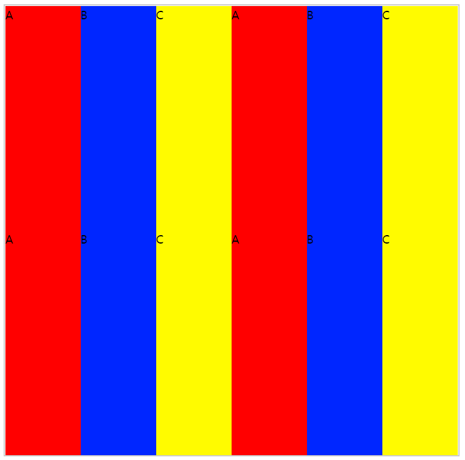
### align-content: flex-start;
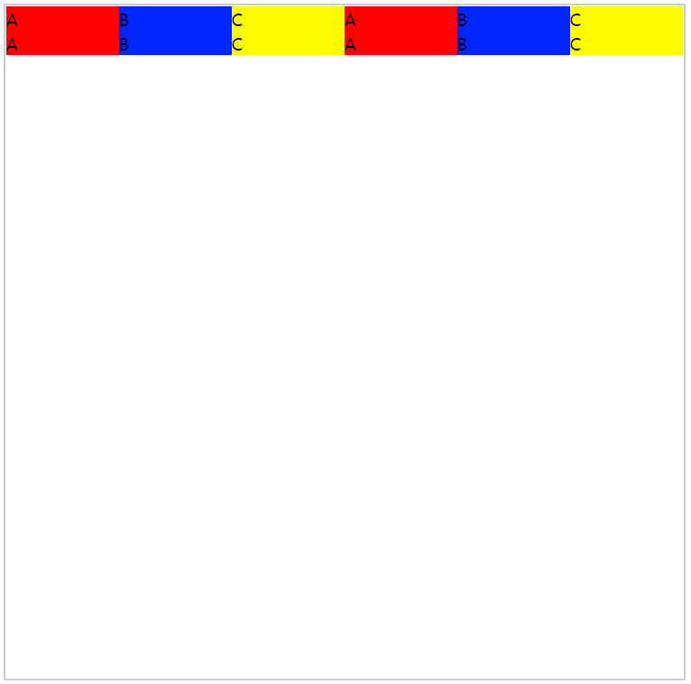
### align-content: flex-end;

### align-content: center;
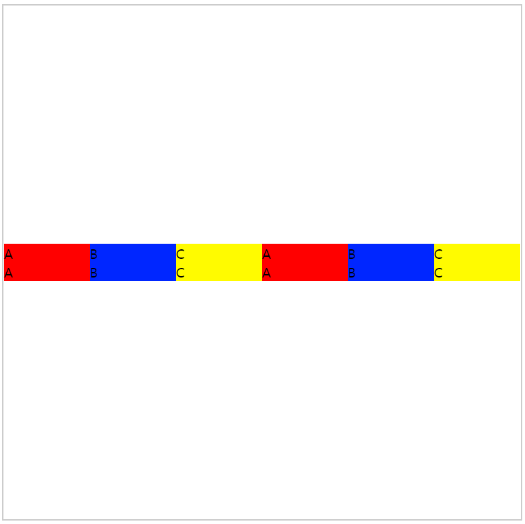
### align-content: space-between;
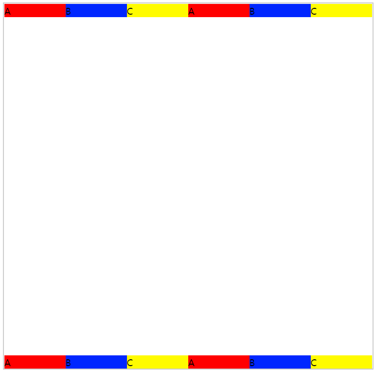
### align-content: space-around
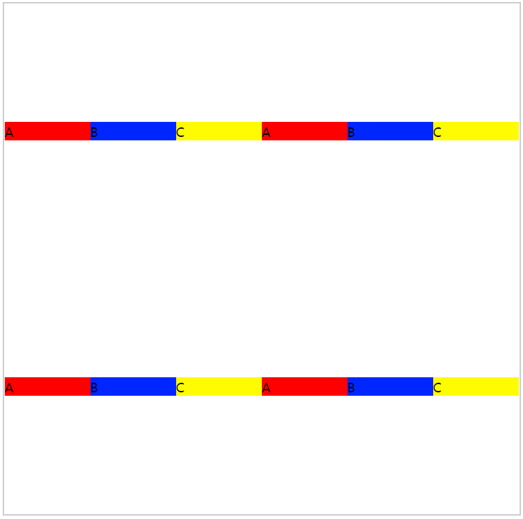
