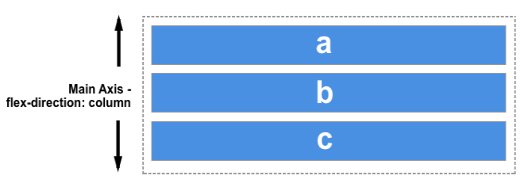
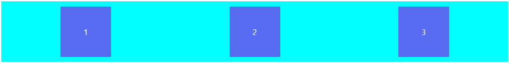

오랜만에 퍼블리싱을 하면서 css flex를 사용하는데 확실한 이해를 위해 정리하게 되었다.

**우선 flex는 container와 items로 나눌 수 있다.**

# container
display: flex를 선언한 부분으로 바로 아래 있는 자식 Element들을 flexible하게 만들어 준다고 이해하면 된다.

### container에 적용할 수 있는 flex 관련 css는 아래와 같다.   
> flex-direction  
flex-wrap  
flex-flow  
justify-content  
align-items  
align-content

## flex-direction
container 내의 items 배치할 때 사용할 Main Axis 및 방향(정방향, 역방향)을 지정하는 속성  
값: row | row-reverse | column | column-reverse

### flex-direction: row; (기본 값)


### flex-direction: row-reverse;


### flex-direction: column;


### flex-direction: column-reverse;


## flex-wrap
items가 container 넓이를 넘어가면 강제로 한줄로 배치할 지 아니면 여러행으로 나누어 표현 할 것인지 결정하는 속성    
값: nowrap | wrap | wrap-reverse

### flex-wrap: nowrap; (기본 값)

### flex-wrap: wrap;

### flex-wrap: wrap-reverse;


## flex-flow
flex-direction, flex-wrap 속성의 단축 속성  
### flex-flow: (flex-direction) (flex-wrap)
```css
/* 예시 */
.flex-container {
  flex-flow: column wrap;
}
```

## justify-content
container의 Main Axis를 따라 items 배치를 어떻게 할지 정의하는 속성  
값: flex-start | flex-end | center | space-around | space-between   

>#### *Main Axis란?
flex-direction 속성에서 설정한 방향으로 row, row-reverse의 Main Axis는 가로가 되고 column, column-reverse의 Main Axis는 세로가 된다.



### justify-content: flex-start; (기본 값)


### justify-content: flex-end;


### justify-content: center;


### justify-content: space-around;


### justify-content: space-between;


## align-items
container에 Cross Axis를 따라 items 배치를 어떻게 할지 정의하는 속성  
값: stretch | flex-start | flex-end | center | baseline

>#### *Cross Axis란?
Main Axis의 반대 (가로 <-> 세로)


※ 아래 이미지는 flex-direction: row가 기준
### align-items: stretch; (기본 값)


### align-items: flex-start;


### align-items: flex-end;


### align-items: center;


### align-items: baseline;


## align-content
align-items와 비슷, 하지만 align-items는 각각 item의 안에서 위치를 잡지만, align-content는 그룹으로 위치를 잡는다.   
값: stretch | space-between | center | space-around | flex-start | flex-end  
  
※ 아래 이미지는 flex-direction: row가 기준
### align-content: stretch; (기본 값)

### align-content: flex-start;

### align-content: flex-end;

### align-content: center;

### align-content: space-between;

### align-content: space-around


---
참고: developer.mozilla.org