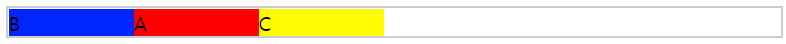
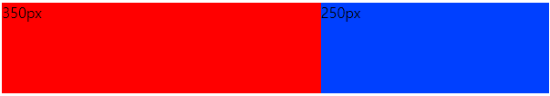
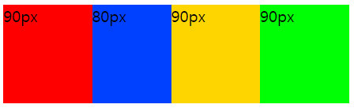
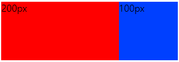
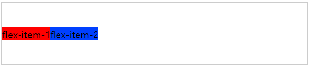
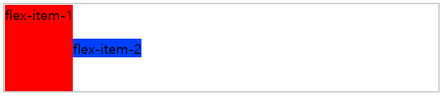
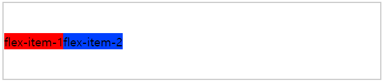
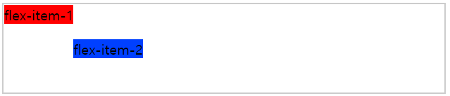
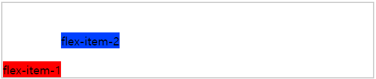
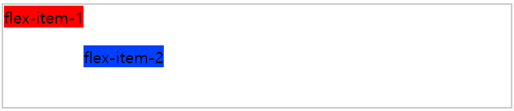

Container에 선언된 엘리멘트의 바로 아래 자식 Element를 의미한다.

## order
순서를 지정 할 수 있다.
```css
.container {
    display: flex;
    border: 2px solid #ccc;
}
.item-a {
    width: 100px;
    background: #ff0000;
    order: 2;
}
.item-b {
    width: 100px;
    background: #0026ff;
    order: 1;
}
.item-c {
    width: 100px;
    background: #fffb00;
    order: 3;
}
```
```html
<div class="container">
  <div class="item-a">A</div>
  <div class="item-b">B</div>
  <div class="item-c">C</div>
</div>
```


## flex-grow
나머지 플렉스 아이템에 비해 얼마나 증가할지 지정함

계산식:  
(grow / total grow) * Space remaining + basis  

위 계산식으로만 보면 이해가 안가니 예제 코드를 통해 대입 해 보자.  

```css
.flex-container {
  display: flex;
  width: 600px;
  height: 100px;
}

.flex-item-1 {
  flex-grow: 3;
  flex-basis: 200px;
  background: #ff0000;
}

.flex-item-2 {
  flex-grow: 1;
  flex-basis: 200px;
  background: #0040ff;
}
```
```html
<div class="flex-container">
  <div class="flex-item-1"></div>
  <div class="flex-item-2"></div>
</div>
```
위 코드를 계산식에 대입 해 보면  
Total basis: 400px(200px + 200px)   
Total grow: 4(3 + 1)
Space remaining: 200px (600px - 400px) (container 넓이 - Total-basis)

flex-item-1: 3/4 x 200px = 150px + 200px = 350px  
flex-item-2: 1/4 x 200px = 50px + 200px = 250px


## flex-shrink
나머지 플렉스 아이템에 비해 얼마나 감소할지 지정할 때 사용함

계산식:  
flex-item: flex-shrink * flex-basis / (flex-shrink * basis + ... + flex-shrink * basis) * Space remaining + flex-basis

위 계산식으로만 보면 이해가 안가니 예제 코드를 통해 대입 해 보자.

```css
.flex-container {
    display: flex;
    width: 350px;
    height: 100px;
}

.flex-item-1 {
    flex-shrink: 1;
    flex-basis: 100px;
    background: #ff0000;
}

.flex-item-2 {
    flex-shrink: 2;
    flex-basis: 100px;
    background: #0040ff;
}

.flex-item-3 {
    flex-shrink: 1;
    flex-basis: 100px;
    background: #ffd500;
}

.flex-item-4 {
    flex-shrink: 1;
    flex-basis: 100px;
    background: #00ff05;
}
```

```html
<div class="flex-container">
  <div class="flex-item-1"></div>
  <div class="flex-item-2"></div>
  <div class="flex-item-3"></div>
  <div class="flex-item-4"></div>
</div>
```
위 코드를 계산식에 대입 해 보면  
Total basis: 400px(100px + 100px + 100px + 100px)   
Space remaining: -50px (350px - 400px)

flex-item-1: (1 x 100px) / (1 x 100px + 2 x 100px + 1 x 100px + 1 x 100px) = 0.2 x -50px = - 10px + 100px = 90px  
flex-item-2: (2 x 100px) / (1 x 100px + 2 x 100px + 1 x 100px + 1 x 100px) = 0.4 x -50px = - 20px + 100px = 80px  
flex-item-3: (1 x 100px) / (1 x 100px + 2 x 100px + 1 x 100px + 1 x 100px) = 0.2 x -50px = - 10px + 100px = 90px  
flex-item-4: (1 x 100px) / (1 x 100px + 2 x 100px + 1 x 100px + 1 x 100px) = 0.2 x -50px = - 10px + 100px = 90px



## flex-basis
flex의 초기 길이를 지정하는 속성
```css
.flex-container {
  display: flex;
  height: 100px;
}

.flex-item-1 {
  flex-basis: 200px;
  background: #ff0000;
}

.flex-item-2 {
  flex-basis: 100px;
  background: #0040ff;
}
```

```html
<div class="flex-container">
  <div class="flex-item-1"></div>
  <div class="flex-item-2"></div>
</div>
```


## flex
flex-grow flex-shrink flex-basis 속성을 하나의 속성으로 사용하는 것으로  
예를 들어 flex: 1 2 auto라 설정하면  
flex-grow: 1; flex-shrink: 2; flex-basis: auto 와 같다.

#### flex: auto
flex-grow: 1;  
flex-shrink: 1;  
flex-basis: auto;  

#### flex: initial
flex-grow: 0;  
flex-shrink: 1;  
flex-basis: auto;

#### flex: none
flex-grow: 0;  
flex-shrink: 0;  
flex-basis: auto;

#### flex: 1
flex-grow: 1;  
flex-shrink: 1;  
flex-basis: 0; 

#### flex: 2
flex-grow: 2;  
flex-shrink: 1;  
flex-basis: 0;  

#### flex: 10%
flex-grow: 1;  
flex-shrink: 1;  
flex-basis: 10%;

#### flex: 10px
flex-grow: 1;  
flex-shrink: 1;  
flex-basis: 10px;

#### flex: 10em
flex-grow: 1;  
flex-shrink: 1;  
flex-basis: 10em;

## align-self
세로 정렬을 정의함  
align-items에 속성과 비슷하고 개별로 설정한다고 이해하면 된다.  

auto|stretch|center|flex-start|flex-end|baseline|initial|inherit;

### auto
기본값으로 부모 컨테이너의 align-items의 속성을 물려받음  
부모 컨테이너가 없는 경우 stretch로 정의 됨

```css
.flex-container {
  display: flex;
  align-items: center;
  border: 2px solid #ccc;
  width: 500px;
  height: 100px;
}

.flex-item-1 {
  background: #ff0000;
}

.flex-item-2 {
  background: #0040ff;
}
```

```html
<div class="flex-container">
  <div class="flex-item-1" style="align-self: auto">flex-item-1</div>
  <div class="flex-item-2">flex-item-2</div>
</div>
```


### stretch
부모 컨테이너의 맞게 채워짐  
```html
<div class="flex-container">
  <div class="flex-item-1" style="align-self: stretch">flex-item-1</div>
  <div class="flex-item-2">flex-item-2</div>
</div>
```


### center
부모 컨테이너의 중앙에 위치
```html
<div class="flex-container">
  <div class="flex-item-1" style="align-self: center">flex-item-1</div>
  <div class="flex-item-2">flex-item-2</div>
</div>
```


### flex-start
부모컨테이너의 시작(상단)에 위치
```html
<div class="flex-container">
  <div class="flex-item-1" style="align-self: flex-start">flex-item-1</div>
  <div class="flex-item-2">flex-item-2</div>
</div>
```


### flex-end
부모컨테이너의 끝(하단)에 위치
```html
<div class="flex-container">
  <div class="flex-item-1" style="align-self: flex-end">flex-item-1</div>
  <div class="flex-item-2">flex-item-2</div>
</div>
```


### baseline
부모컨테이너의 기준선에 배치
```html
<div class="flex-container">
  <div class="flex-item-1" style="align-self: baseline">flex-item-1</div>
  <div class="flex-item-2">flex-item-2</div>
</div>
```


### initial
기본값으로 설정

### inherit
부모요소에서 이 속성을 상속

