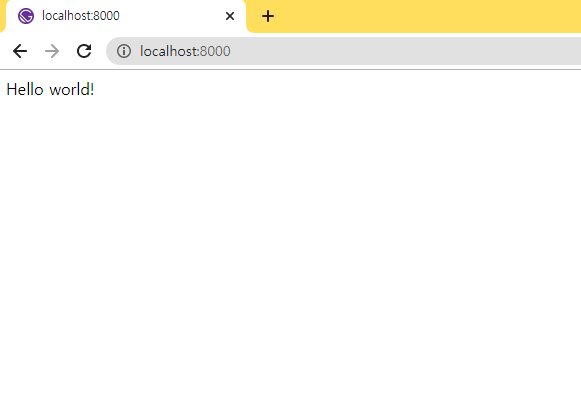

## gatsby-cli 설치

```bash
npm install -g gatsby-cli
```

## gatsby starter를 이용한 gatsby 프로젝트 생성

```bash
gatsby new my-blog https://github.com/gatsbyjs/gatsby-starter-hello-world

```

## gatsby 개발서버 실행

생성한 프로젝트 폴더로 이동 후

```bash
cd my-blog
npm run develop
```



## typescript 설정

### 확장자 변경
/src/pages/index.js => /src/pages/index.tsx

### /tsconfig.json
```json
{
  "compilerOptions": {
    "jsx": "react",
    "strict": true
  }
}
```