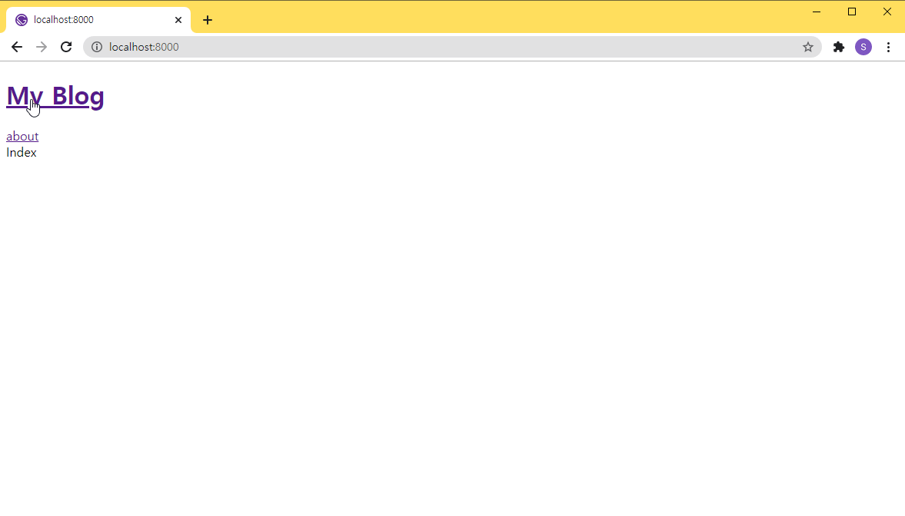

## 컴포넌트 생성

### src/components/header.tsx

```tsx
import * as React from 'react';
import { Link } from 'gatsby';

const Header = (): JSX.Element => (
  <header>
    <h1>
      <Link to="/">My Blog</Link>
    </h1>
    <Link to="/about">about</Link>
  </header>
);

export default Header;
```

### src/components/layout.tsx

```tsx
import * as React from 'react';
import Header from './header';

interface Props {
  children: React.ReactNode
}

const Layout = ({ children }: Props): JSX.Element => (
  <div>
    <Header />
    {children}
  </div>
);

export default Layout;
```

## Layout 컴포넌트 적용

### src/pages/index.tsx

```tsx
import * as React from 'react';
import Layout from '../components/layout';

const IndexPage = (): JSX.Element => <Layout>Index</Layout>;

export default IndexPage;
```

### src/pages/about.tsx

```tsx
import * as React from 'react';
import Layout from '../components/layout';

const AboutPage = (): JSX.Element => <Layout>About</Layout>;

export default AboutPage;
```


