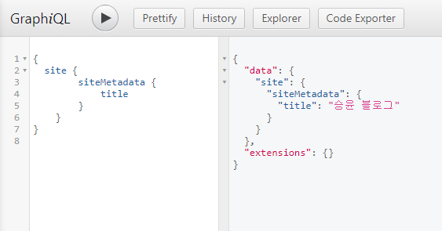
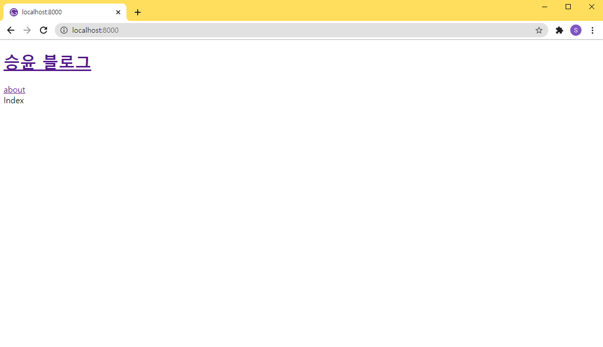

## metadata 설정

### /gatsby-config.js

```javascript
module.exports = {
  siteMetadata: {
    title: '승윤 블로그',
  },
  plugins: [],
};
```

## metadata 정보로 타이틀 적용

### 쿼리 정보

```graphql
query {
  site {
    siteMetadata {
      title
    }
  }
}
```



### /components/header.tsx

```tsx
import * as React from 'react';
import { graphql, Link, useStaticQuery } from 'gatsby';

type DataProps = {
  site: {
    siteMetadata: {
      title: string;
    };
  };
};

const Header = (): JSX.Element => {
  const data: DataProps = useStaticQuery(graphql`
    query {
      site {
        siteMetadata {
          title
        }
      }
    }
  `);

  return (
    <header>
      <h1>
        <Link to="/">{data.site.siteMetadata.title}</Link>
      </h1>
      <Link to="/about">about</Link>
    </header>
  );
};

export default Header;
```



※ config 파일 변경 시 재시작을 추천함
