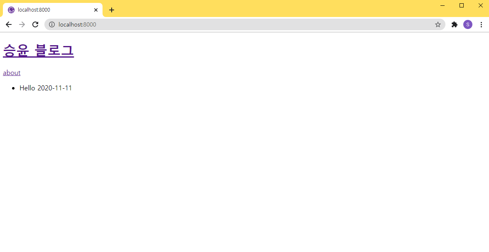

## 디렉토리 파일 읽게 해주는 plugin 설치 및 설정

https://www.gatsbyjs.com/plugins/gatsby-source-filesystem/

```bash
npm install gatsby-source-filesystem
```

### /gatsby-config.js

```javascript
module.exports = {
  siteMetadata: {
    title: '승윤 블로그',
  },
  plugins: [
    {
      resolve: 'gatsby-source-filesystem',
      options: {
        name: 'src',
        path: `${__dirname}/src/`,
      },
    },
  ],
};
```

### 파일 목록 query
```graphql
query {
  allFile {
    edges {
      node {
        name
        extension
        dir
      }
    }
  }
}
```


## markdown 목록 생성

### /src/posts/hello.md

```markdown
---
title: 'Hello'
date: '2020-11-11'
---

안녕하세요!
```

### gatsby-transformer-remark 설치 및 설정

https://www.gatsbyjs.com/plugins/gatsby-transformer-remark/

```bash
npm install gatsby-transformer-remark
```

### /gatsby-config.js

```javascript
module.exports = {
  siteMetadata: {
    title: '승윤 블로그',
  },
  plugins: [
    {
      resolve: 'gatsby-source-filesystem',
      options: {
        name: 'src',
        path: `${__dirname}/src/`,
      },
    },
    'gatsby-transformer-remark',
  ],
};
```

### markdown 파일 목록 query

```graphql
query {
  allMarkdownRemark {
    edges {
      node {
        frontmatter {
          title
          date
        }
      }
    }
  }
}
```


### /src/pages/index.tsx

```tsx
import * as React from 'react';
import { graphql, Link, PageProps } from 'gatsby';
import Layout from '../components/layout';

type DataType = {
  allMarkdownRemark: {
    edges: {
      node: {
        frontmatter: {
          title: string;
          date: string;
        };
      };
    }[];
  };
};

export const pageQuery = graphql`
  query IndexQuery {
    allMarkdownRemark {
      edges {
        node {
          frontmatter {
            title
            date
          }
        }
      }
    }
  }
`;

const IndexPage = ({ data }: PageProps<DataType>): JSX.Element => {
  const posts = data.allMarkdownRemark.edges;
  return (
    <Layout>
      <ul>
        {posts.map((post) => (
          <li>
            {post.node.frontmatter.title}
            {post.node.frontmatter.date}
          </li>
        ))}
      </ul>
    </Layout>
  );
};

export default IndexPage;
```


