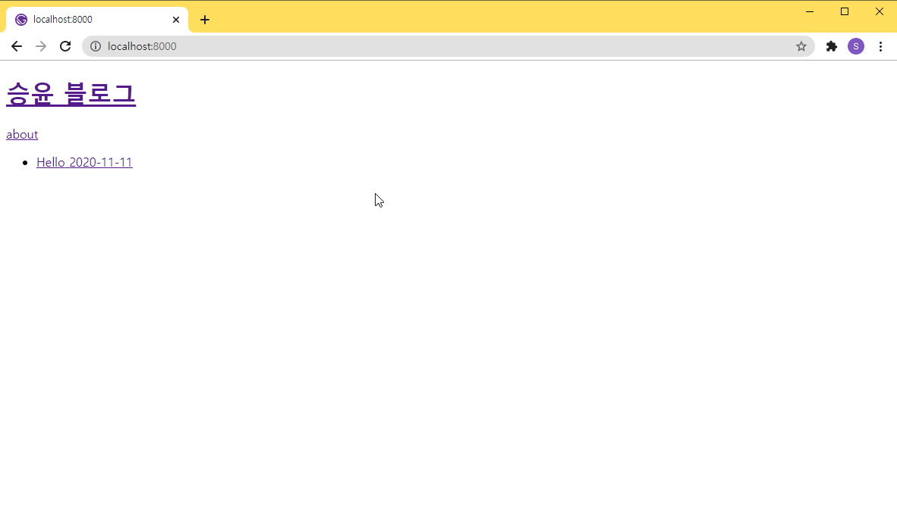

## /gatsby-node.js

```javascript
import path from "path"

module.exports.onCreateNode = ({ node, actions }) => {
  const { createNodeField } = actions

  if (node.internal.type === `MarkdownRemark`) {
    const slug = path.basename(node.fileAbsolutePath, `.md`)

    createNodeField({
      node,
      name: `slug`,
      value: slug,
    })
  }
}
```

## /src/pages/index.tsx

```tsx
import * as React from 'react';
import { graphql, Link, PageProps } from 'gatsby';
import Layout from '../components/layout';

type DataType = {
  allMarkdownRemark: {
    edges: {
      node: {
        frontmatter: {
          title: string;
          date: string;
        };
        fields: {
          slug: string
        }
      };
    }[];
  };
};

export const pageQuery = graphql`
    query IndexQuery {
        allMarkdownRemark {
            edges {
                node {
                    frontmatter {
                        title
                        date
                    }
                    fields {
                        slug
                    }
                }
            }
        }
    }
`;

const IndexPage = ({ data }: PageProps<DataType>): JSX.Element => {
  const posts = data.allMarkdownRemark.edges;
  return (
    <Layout>
      <ul>
        {posts.map((post) => (
          <li>
            <Link to={post.node.fields.slug}>
              {post.node.frontmatter.title}
              {post.node.frontmatter.date}
            </Link>
          </li>
        ))}
      </ul>
    </Layout>
  );
};

export default IndexPage;
```

## /gatsby-node.js

```javascript
const path = require(`path`)

module.exports.onCreateNode = ({ node, actions }) => {
  const { createNodeField } = actions

  if (node.internal.type === `MarkdownRemark`) {
    const slug = path.basename(node.fileAbsolutePath, `.md`)

    createNodeField({
      node,
      name: `slug`,
      value: slug,
    })
  }
}

module.exports.createPages = async ({ graphql, actions }) => {
  const { createPage } = actions
  const postTemplate = path.resolve(`./src/templates/post.tsx`)
  const res = await graphql(`
    query {
      allMarkdownRemark {
        edges {
          node {
            fields {
              slug
            }
          }
        }
      }
    }
  `)

  const posts = res.data.allMarkdownRemark.edges
  posts.forEach(post => {
    createPage({
      component: postTemplate,
      path: `${post.node.fields.slug}`,
      context: {
        slug: post.node.fields.slug,
      },
    })
  })
}
```

## /src/template/post.tsx

```tsx
import * as React from 'react';
import { graphql } from 'gatsby';
import Layout from '../components/layout';

export const query = graphql`
    query($slug: String!) {
        markdownRemark(fields: { slug: { eq: $slug } }) {
            frontmatter {
                title
                date
            }
            html
        }
    }
`;

type DataType = {
  data: {
    markdownRemark: {
      frontmatter: {
        title: string
        date: string
      }
      html: string
    }
  }
};

const Post = ({ data }: DataType): JSX.Element => {
  const post = data.markdownRemark;
  return (
    <Layout>
      <h1>{post.frontmatter.title}</h1>
      <p>{post.frontmatter.date}</p>
      <div dangerouslySetInnerHTML={{ __html: post.html }} />
    </Layout>
  );
};

export default Post;
```


