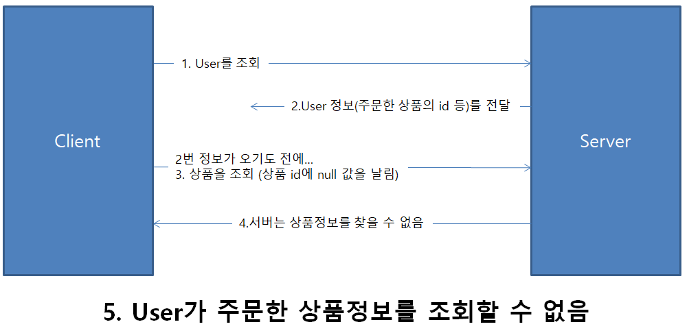
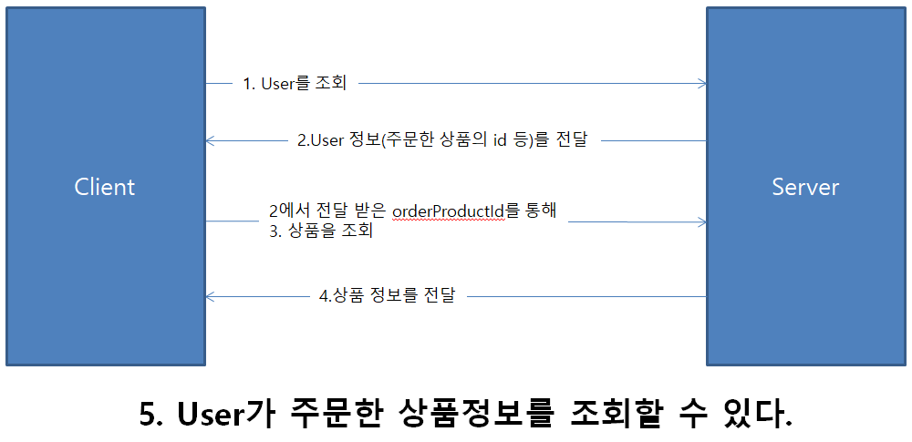
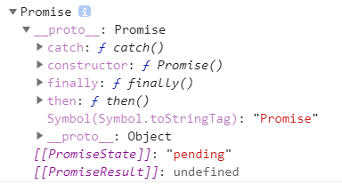
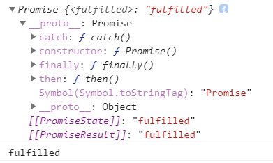
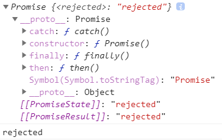

Promise는 자바스크립트에서 비동기 처리를 위해 사용되는 객체다. 알다시피 Promise의 의미는 약속이라는 의미다. `처리하면 알려줄게`라고 약속한다고 생각하면 될 것 같다.

## 비동기란?
동기의 경우 작업을 실행하면 결과를 받을 때까지 다른 일을 할 수가 없지만,  
비동기의 경우 작업을 실행하고 결과를 받을 때까지 기다릴 필요 없이 다른 일을 할 수가 있는 차이가 있다.

실생활에서 비동기의 예시를 드는 것이 카페에서 진동벨이다. 커피 주문을 하고 그 자리에서 주문한 커피를 기다려 받을 필요 없이, 나는 다른 일을 하면서 진동벨이 울리면 주문한 커피를 받으면 되는 것이다.  

자바스크립트는 싱글 스레드로 한 번에 하나의 작업만 처리 할 수 있지만, 비동기를 통해 동시에 많은 작업을 수행 할 수가 있다.


## Promise 사용법
```javascript
let testPromise1 = new Promise((resolve, reject) => {
  setTimeout(() => {
    // 2000ms 지나면 알려줄게!
    resolve('안녕!');
  }, 2000)
})

// 알려주는 값을 알기 위해서는 then을 통해 전달 받자!
testPromise1.then(value => {
  console.log(value)
});
```

## Promise 사용 예
만약 쇼핑몰 사이트에서 유저가 주문한 상품의 상세 정보를 조회를 해야 한다.  
#### flow:  
\- 유저를 조회하고 조회한 유저의 주문한 상품 정보를 조회한다.

### 비동기로 인해 상품 정보를 조회할 수가 없다. (동시에 2개가 요청이 가버림) 
```javascript
// 예시 코드로 getUserById, getProductById 비동기 객체라는 가정을 한다.
let user = getUserById('유저ID');
let product = getProductById(user.orderProductId);
// product 값을 조회 할 수 없다.
```


### 이때 Promise를 사용하여 해결 할 수 있다.
```javascript
// getUserByID와 getProductId는 Promise 객체로 바꿔 주었다.
getUserById('유저ID').then(user => {
  getProductId(user.orderProductId).then(product => {
    // product 값을 조회 할 수 있다.
  });
});
```



## Promise의 3가지 상태

### Pending
\- Promise 코드가 생성만 되고 실행 되기전 상태(대기)
```javascript
let promiseTest = new Promise((resolve, reject) => {})
console.log(promiseTest);
```


### Fulfilled
\- 성공 (then을 통해 값을 받을 수 있다.)
```javascript
let promiseTest = new Promise((resolve, reject) => {
  resolve('fulfilled')
})
console.log(promiseTest);
promiseTest.then(value => {
  console.log(value);
})
```


### Rejected
\- 실패 (catch를 통해 값을 받을 수 있다.)
```javascript
let promiseTest = new Promise((resolve, reject) => {
    reject('rejected');
})
console.log(promiseTest);
promiseTest.catch(error => {
    console.log(error);
})
```


#### MDN Promise


## async/await
```javascript
function callPromises() {
  promise1.then(() => {
    promise2.then(() => {
      promise3.then(() => {
        promise4.then(() => {

        }).catch(() => {

        })
      }).catch(() => {

      })
    }).catch(() => {

    })
  }).catch(() => {

  })
}
``` 
위 코드를 보게 되면 읽기도 힘들 뿐더러 유지 보수하기도 어렵다.  
이때 async/await를 써주면 읽기 좋은 코드가 된다.
```javascript
async function callPromises() {
  await promise1();
  await promise2();
  await promise3();
  await promise4();
}
```

얼마나 심플한가. 여기서 reject 처리를 위해 try / catch 문을 같이 써주면 좋다.

```javascript
async function callPromises() {
  try {
    await promise1();
    await promise2();
    await promise3();
    await promise4(); 
  } catch (error) {
    
  }
}
```


#### 참고:  
https://developer.mozilla.org/ko/docs/Web/JavaScript/Reference/Global_Objects/Promise  
https://programmingsummaries.tistory.com/325  
https://velog.io/@cyranocoding/2019-08-02-1808-%EC%9E%91%EC%84%B1%EB%90%A8-5hjytwqpqj  
https://joshua1988.github.io/web-development/javascript/promise-for-beginners/
